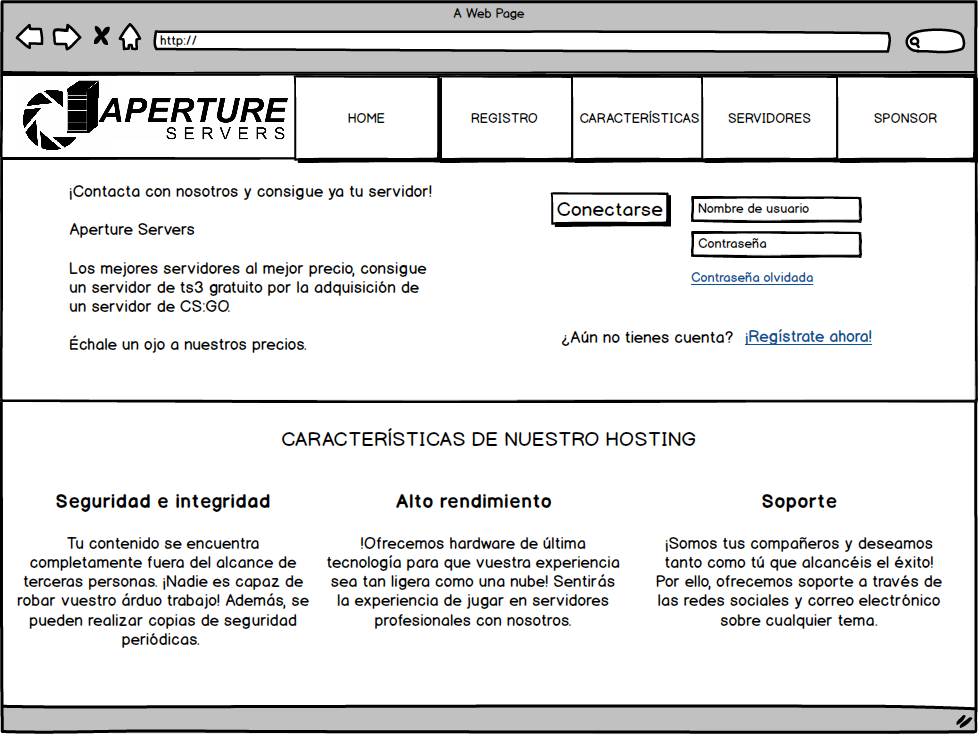
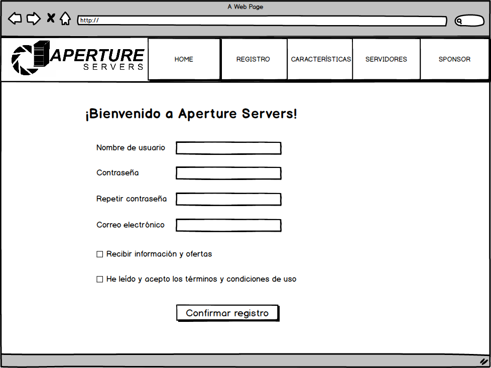
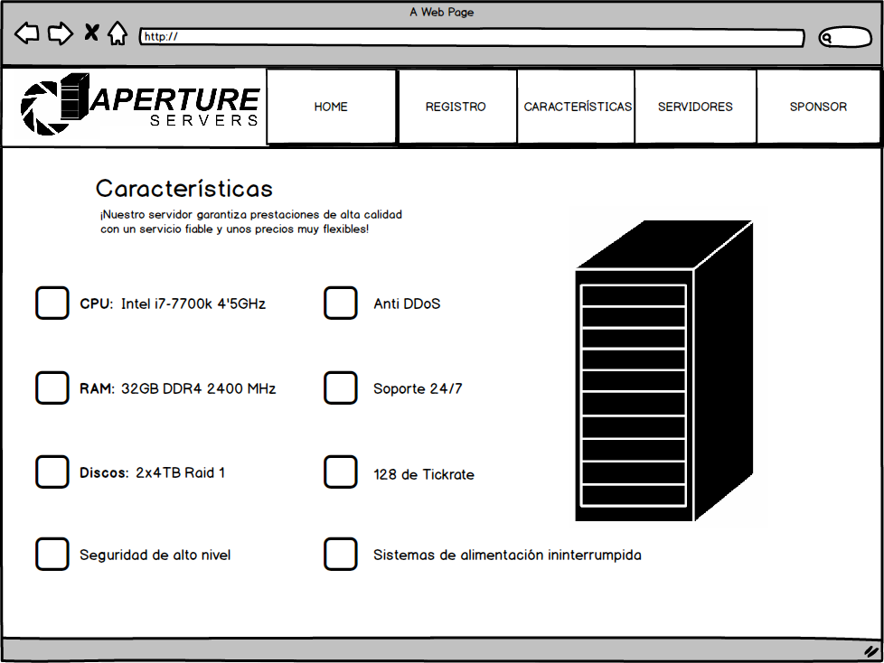
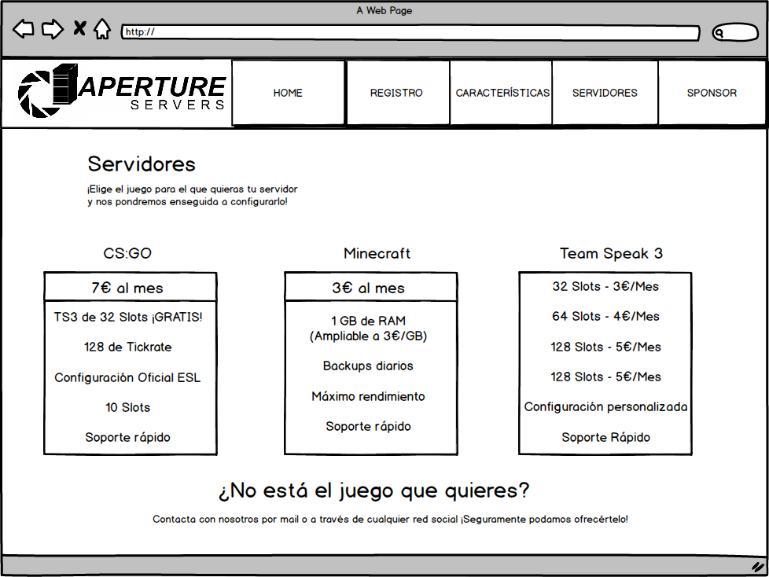
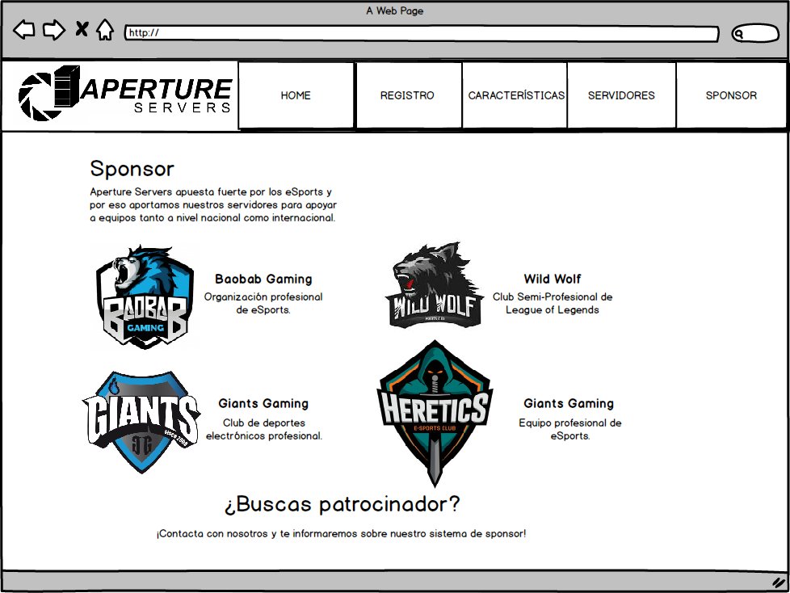
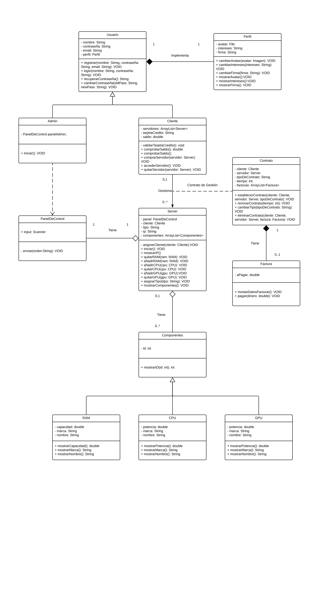
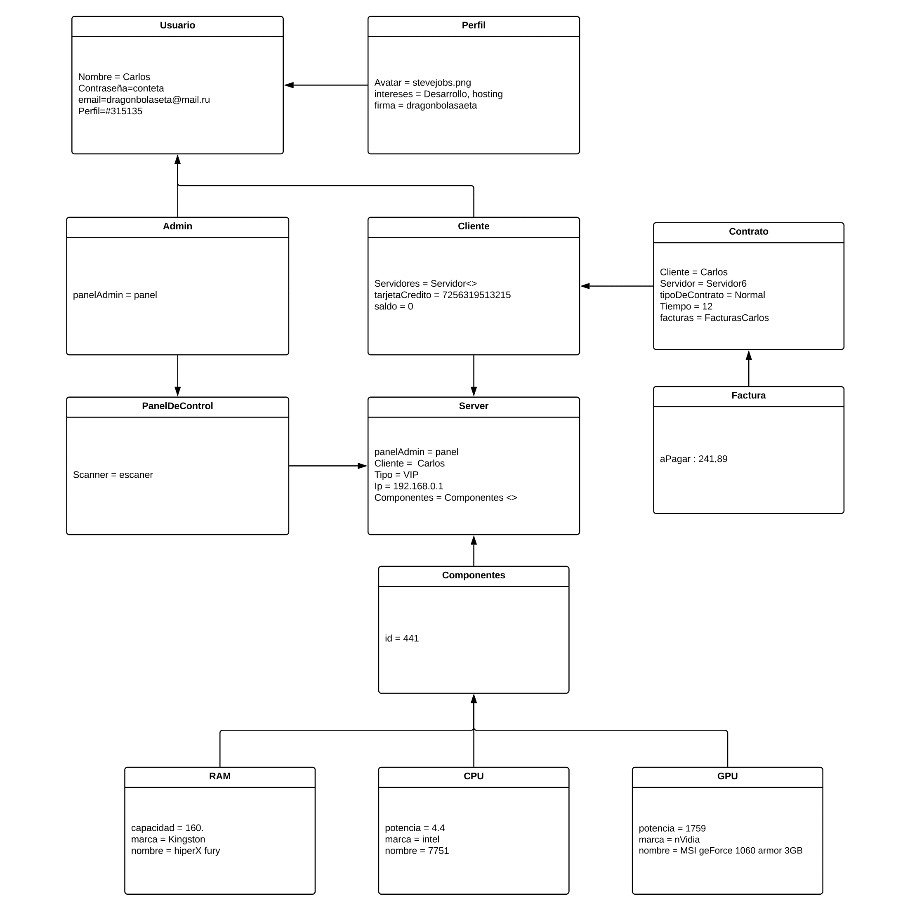

- **Nombre de la aplicación:** Aperture Servers

- **Integrantes del grupo:** Javier Adrián Martínez Castellano, Guillermo Jesús Cano Rama, José Alberto Távora Romero.

- **Introducción:** La aplicación será una página web de hosting, dedicada al alquiler, configuración y mantenimiento de servidores de videojuegos.

- **Herramientas usadas:** 

  - GitHub.

  - Slack.

  - Typora: hemos elegido esta herramienta por su simpleza, en clase acostumbramos a tomar apuntes con el blog de notas y Typora se asemeja mucho, sólo que visualmente es bastante más atractivo, e incluye opciones de edición.

  - Balsamiq: escogemos utilizar Balsamiq por lo intuitivo que es, es bastante sencillo realizar los mockups sin necesidad de consultar manuales o tutoriales.

  - Gimp: utilizamos Gimp para el retoque de los mockups y la realización del logo, al haberlo estudiado en el grado medio lo manejamos con bastante soltura.

- **Mockup**: 

  - Página principal de la web, donde aparecen características básicas de nuestro hosting, un menú de navegación y la opción de logearse:

    

  ​

  - Formulario de registro:

    

  ​

  - Características de nuestro servidor:

    

    ​

  - Servidores para juegos que ofrecemos:

    

    ​

  - Sistema de patrocinador:

    

  - Menú de edición de perfil:

    

    ​

- **Diagrama de clases:**

  ​	

- **Diagrama de objetos:**

  ​	 

  ​

- **Arquitectura web:**

  Hemos escogido la arquitectura REST por varias razones:

  - La mayoría de las páginas conocidas(Amazon, Mega...) utiliza esta arquitectura, es la que está teniendo mayor impacto ahora mismo.
  - Puede usarse desde cualquier cliente HTTP y es mucho mas simple.
  - Es un protocolo sin estado, es decir, no guardamos información en el servidor, consiguiendo así un ahorro de variables de sesión y almacenamiento del servidor.
  - Presenta operaciones bien definidas como pueden set GET, POST o PUT.
  - Utiliza URL's únicas. Las URL's únicas estan identificadas por URI's(Identificador Único de Recurso). Un URI debe ser único, independiente de formato y mantener una jerarquía lógica, entre sus características más comunes.

  Todo esto ayuda a nuestra página ser más cercana al usuario y cómoda.

  ​

- **Tecnologías del frontend:**

    - **Lenguaje**: JavaScript, HTML, CSS.
    - **Core**: NodeJS - Es uno de los mejores framworks de JS actualmente y nos ha resultado el más atractivo.
      - **Frontend Framework:** AngularJS - Es el que está mas extendido entre los desarrolladores y lleva bastantes años siendo usado.

      - **UI Framework:** Bootstrap - Hemos visto lo que es posible hacer con Bootsrap y nos ha parecido el mejor con diferencia.

      - **Editores de texto**: Sublime Text - De los pocos editores que hemos probado, éste es el que más nos ha gustado y el que usamos regularmente.

      - **Control de versiones:** GitHub - Es poco intuitivo, pero es lo único que medianamente sabemos usar.

      - **Gestión de paquetes:** Bower - Utiliza NodeJS y nos ha parecido una herramienta muy potente y útil.

      - **Preprocesador CSS:** Sass - Es muy potente y parece fácil de usar.

      - **Preprocesador JS:** Babel - Tiene muy buenas opiniones por parte de los desarrolladores y en la página oficial explica muy bien como utilizarlo.

      - **Automatización de tareas:** Grunt - Al parecer es muy potente y uno de los más utilizados.

      - **Calidad de código:** JSHint - Es bastante útil para optimizar el código y explica muy bien como hacerlo.

      - **Testing:** Mocha - Utiliza NodeJS y es fácil de usar aparentemente.

      - **Template Engine:**  Jade - También utiliza node y nos ha parecido el mejor de todos los que hemos encontrado.

      - **Frontend performance:** Google PageSpeed - Parece una herramienta bastante buena, y el que sea de google inspira confianza.

      - **Browser refreshing:**  Browsersync - Funciona con NodeJS y además tiene muchas funcionalidades útiles.

      - **Build tools:** RequireJS - Puede ser utilizado en NodeJS y es compatible con la mayoría de navegadores.

      - **Style Guide:** Knyle Style Sheets - Es una buena metodología para documentar CSS y generar guías de estilo, además fue creado por el director de diseño de GitHub.

  ​

- **Tecnologías del backend:**

  Hemos escogido Javascript como Lenguaje de Programación, Oracle WebLogic como Servidor De Datos, Oracle  como Base de Datos y Linux Server como Servidor.

  Javascript lo hemos escogido por su versatilidad, y el boom que está teniendo actualmente.

  Hemos escogido Oracle WebLogic y Oracle como base de datos por su compatibilidad y facilidad al momento de usarlo.

  Hemos escogido Linux Server por su capacidad de añadir nuevos componentes y el hecho de que sea Software Libre.

  ​

- **CMS:**

  Hemos escogido Wordpress por varias razones:

  - Siempre va a estar siendo actualizado y con nuevas funciones por el hecho de que es open source, dejando a los demas desarrolladores contribuir con este magnífico proyecto.
  - No es necesario indagar en un lenguaje de programación, ya que no requiere conocimiento en tal campo, cómoda de utilizar por el usuario final.
  - Es personalizable, tanto con plantillas como contactando con diseñadores profesionales. El diseño es Responsive totalmente, adaptado a pantallas de cualquier tamaño y dispositivos como smartphones.
  - Tu página es totalmente tuya, Wordpress te la ofrece, puedes añadir, quitar, editar...todo lo que te venga en mente.

- **Bibliografía**:

  - https://typora.io
  - http://support.typora.io
  - https://balsamiq.com
  - https://www.creativosonline.org
  - http://www.gimp.org.es

